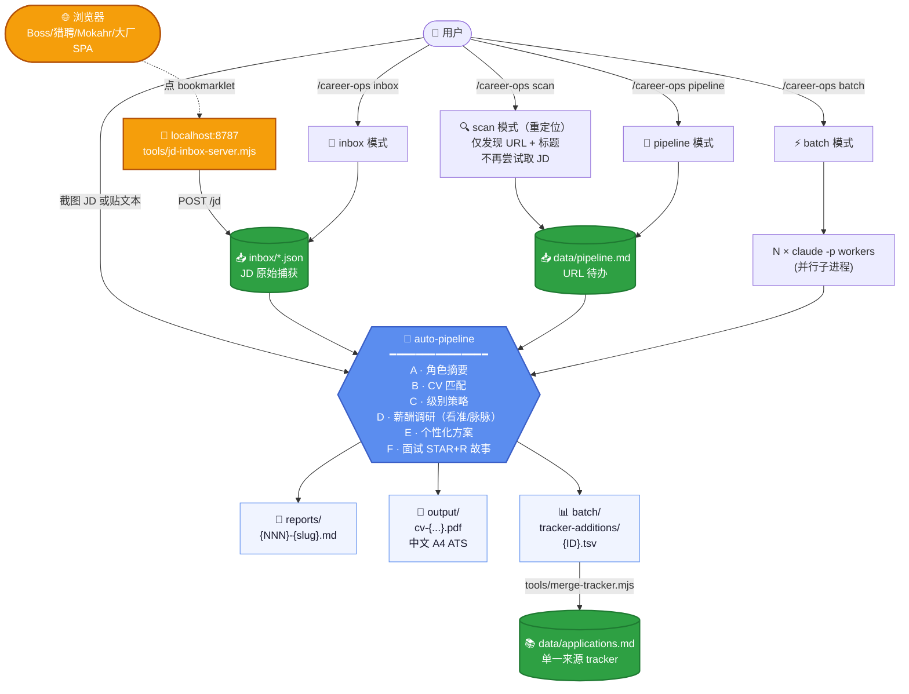

# career-ops-china

> **🇨🇳 中国大陆深度定制版**
>
> 这是 [`santifer/career-ops`](https://github.com/santifer/career-ops) 的中国大陆求职市场深度定制 fork。**所有功能、archetype、数据源、模板都已为国内 AI / 数据 / 后端 / 平台 求职者重新设计**，核心改动包括：
>
> - **16 个 mode 文件** 全部翻译为中文，按国内招聘流程重写（含新增 `inbox` mode）
> - **8 个 archetype** 替换为数据工程 / 数据治理 / 数据仓库 / 大模型应用 / AI Infra / 后端 / 平台架构 / 大数据算法
> - **薪酬调研源** 从 Glassdoor / Levels.fyi / Blind 切换到 **看准网 / 脉脉 / OfferShow / 知乎 / 一亩三分地 / leetcode.cn**
> - **公司调研源** 改用 脉脉职言区 / 天眼查 / 企查查 / IT 桔子 / 36 氪 / 小红书
> - **🔑 Bookmarklet + Local Inbox 工作流**（新）：一键绕过 Boss 直聘 / 猎聘 / Mokahr / 大厂 SPA 的反爬 + 反复制 + 登录墙 — 浏览器点按钮 → 本地服务器接收 JSON → Claude 批量评估。**国内 JD 取数的正确范式**
> - **门户处理范式** 放弃对国内反爬平台的自动化爬取，改为 **截图 / bookmarklet** 人机协作（Playwright / WebFetch 只用于公司自有静态页 + V2EX + GitHub）
> - **预置 50+ 公司**：12 家一线互联网大厂 + 8 家大模型独角兽 + 数据创业 + AI Infra
> - **触达模式** 从 LinkedIn 改为 脉脉 + 微信 双轨
> - **CV 模板** 加入中文字体回退（PingFang SC / Microsoft YaHei / Noto Sans SC）
> - **硬红线机制** 直接 SKIP 不接受的公司类型（用户可定义如华为/外包/大小周），含 **HR 派遣公司识别**（人瑞 / 中智 / FESCO / 外企德科 / 万宝盛华 / 科锐国际 等）
> - **大厂职级对标** 加入阿里 P / 字节 / 腾讯 T / 美团 L 等职级映射表
>
> 原版 [`santifer/career-ops`](https://github.com/santifer/career-ops) 在 MIT License 下保留所有版权 — 见 [LICENSE](LICENSE)。

---

## ⚠️ 通用性说明 — 不只是给数据/AI 求职者

虽然这个 fork 的**预置**配置（archetype、portals 公司清单、薪酬调研词条、deal_breakers 模板）是围绕**数据工程师 + AI 工程师 + 大模型应用工程师**做的，但**整个系统的工作流是通用的**：A-F 评估、CV 匹配、薪酬调研、tracker 入库、PDF 生成、bookmarklet inbox 都和你的目标岗位无关。

**换方向只需告诉 Claude 改几个文件**（不要手动改，让 Claude 改最快）：

| 你想做什么方向 | 让 Claude 改 |
|----------------|--------------|
| 后端 / 全栈 / SRE / 运维 | `modes/_profile.md` 的 archetype 表 + `portals.yml` 的 title_filter + tracked_companies |
| 前端 / 客户端 / 移动端 | 同上 + 把"前端/iOS/Android"从 negative 移到 positive |
| 产品经理 / 运营 / 增长 | archetype 替换为 PM/运营 + 评估维度 weights 调整（技术栈 → 业务能力） |
| 算法研究 / 学术岗 | archetype 改为 Research Scientist + 加 ICLR/NeurIPS 等会议关键词 |
| 销售 / 市场 / HR / 法务 | 重写 archetype + 评分维度从"技术栈"换成"行业经验/客户网络/语言能力" |
| 海外岗（任何方向）| 改用上游 [`santifer/career-ops`](https://github.com/santifer/career-ops)（薪酬源用 Glassdoor/Levels.fyi 而非看准网） |
| 其他冷门方向（医疗 / 法律 / 教育 / 制造业）| 直接和 Claude 描述你的方向，它会重写 archetypes + 数据源 + framing |

**操作只需一句话**：跟 Claude 说"我是 [方向] 的，请把整个系统调整到这个方向"，它会改 `_profile.md`（archetype + 叙事）/ `profile.yml` / `portals.yml` / `cv-template.html` 等所有相关文件。

> 设计哲学：**文件即配置，Claude 即编辑器**。系统不是给"数据/AI 求职者"专用的 — 是给"任何想用 AI 助手做精准求职的人"用的。预置只是起点，不是边界。

---

## 这个项目是什么

**career-ops-china 把 Claude Code 变成一个中国大陆求职指挥中心**：贴一个岗位 JD 进来，AI 会自动跑完整 6 块评估（A-F），生成针对该岗位的 ATS 优化简历 PDF，把申请入库追踪。再加上薪资调研、面试故事库、谈判话术、批量扫描、申请表助手、脉脉/微信 触达消息生成等十几个独立 mode。

> ⚠️ **这不是海投工具，是过滤器**。系统对 < 4.0/5 分的岗位会强烈不建议申请。所有动作的最后一步永远是用户决定是否提交。

### 适合谁

⚠️注意：求职方向仅供参考，你可以自己更改或者系统会根据你 cv.md 里的经历和技能自动检测 archetype，如果 JD 对齐度高但不完全匹配预置 archetype，也会给出合理的评估和建议。

- **求职方向**：数据工程 / 数据治理 / 数据仓库 / 大模型应用 / AI Infra / 后端（数据/AI 方向）/ 平台架构 / 大数据算法
- **目标 base**：北京 / 上海 / 深圳 / 杭州 / 苏州 / 南京 / 广州（其他城市也可，但门户预置主要覆盖一线和 AI 中心）
- **目标公司**：互联网大厂 + 大模型独角兽 + 数据/AI 创业中小厂 + 海外华人公司

### 不适合谁

- 想海投上千家公司碰运气 — 系统会引导你减少投递、提升匹配度
- 想找海外岗位 — 用上游 [`santifer/career-ops`](https://github.com/santifer/career-ops) 更合适

---

## 它的工作原理



### A-F 六块评估（核心）

每个 JD 进来都会跑 6 个 block：

| Block | 内容 | 配置位置 |
|------|------|---------|
| **A 角色摘要** | Archetype、Domain、Function、Seniority、业务方向、Base 城市、TL;DR | `_profile.md`（archetype 列表）|
| **B CV 匹配** | JD 每条要求 → 候选人 cv.md 对应行；列出 gaps + 缓解策略 | `_profile.md`（自适应包装表）|
| **C 级别策略** | JD 暗示级别 vs 候选人自然级别；「不撒谎卖资深」/「被压级」两套话术 | 大厂职级对标表 |
| **D 薪酬与需求** | **看准网/脉脉/OfferShow/知乎** 调研薪资段、口碑、工时、业务前景 | 数据源列表 |
| **E 个性化方案** | Top 5 CV 修改 + Top 5 LinkedIn/脉脉资料修改 | — |
| **F 面试准备** | 6-10 个 STAR+R 故事 + 主讲 case study + 红线问题预演 | 国内 HR 红线问题（离职原因/996/婚育） |

### 8 个 archetype（中国大陆特化，仅供参考）

| Archetype | 主题轴 | 公司在买什么 |
|---|---|---|
| **数据工程师 / Data Engineer** | ETL/ELT、Spark/Flink、调度 | 把数据稳定汇总进数仓的人 |
| **数据仓库 / 数据平台 / DWH** | 分层建模、湖仓、Doris/StarRocks/CK | 从 0 到 1 或迭代企业级数仓的架构者 |
| **数据治理 / Data Governance** | 元数据、血缘、质量、合规、主数据 | 让数据"用得起、管得住、信得过"的人 |
| **大模型应用工程师 / LLM Engineer** | RAG、Agent、Prompt、向量检索、Eval | 把大模型落地业务并保证质量的人 |
| **AI Infra / 大模型基础设施** | vLLM/SGLang、训推、显存优化、GPU 调度 | 让大模型跑得快、稳、便宜的人 |
| **后端工程师（数据/AI 方向）** | Java/Go/Python、高并发、中间件 | 业务后端扎实、能配合数据/AI 团队 |
| **平台工程师 / 架构师** | 内部平台、MLOps、CI/CD、SRE | 工程组织"地基"做好的人 |
| **大数据算法 / 数据科学** | 推荐、风控、AB、特征工程 | 用数据驱动业务并落地模型的人 |

### 评分维度（10 维加权，针对中国市场重新分配权重）

| 维度 | 权重 | 备注 |
|------|------|------|
| 北极星对齐 | 25% | 与目标 archetype 的对齐度 |
| CV 匹配度 | 15% | 简历真实匹配 JD 的程度 |
| 级别（资深+） | 15% | JD 暗示的职级 vs 候选人自然级别 |
| **Comp（含工时折算）** | **15%**（原 10%） | 国内薪酬差异大，权重提高 |
| 成长路径 | 10% | 团队是否扩张 / 技术方向是否前沿 |
| **工时与生活** | **10%**（原 5%） | 大小周/996 直接影响生活质量 |
| **公司稳定性** | **10%**（原 5%） | 国内裁员频繁，稳定性关键 |
| 技术栈现代度 | 5% | 是否前沿（大模型 / 湖仓 / Agent 等） |
| 流程速度 | 5% | 内推 / HR 流程的速度 |
| 文化信号 | 5% | 工程师文化 vs 官僚文化 |

> **删除维度：远程质量** — 国内远程岗几乎不存在，没有评估意义。

### 硬红线机制（你定义，系统执行）

在 `config/profile.yml` 里写下你不接受的公司类型，系统在评估前直接判 SKIP：

```yaml
deal_breakers:
  - "HUAWEI（任何 BU、任何子公司）"
  - "大小周"
  - "外包 / OD / 派遣"
```

每次 scan / 评估都会先检查红线，命中直接跳过不浪费精力。

### 国内招聘门户的处理

国内门户和西方差异巨大，系统针对每种情况有不同策略：

| 平台 | 问题 | 系统处理（2026-04 后） |
|------|------|---------------------|
| **V2EX 招聘 / GitHub README / 公司自有静态 careers** | 公开无限制 | ✅ WebFetch 直接取 |
| **大厂 careers SPA**（字节 / 阿里 / 腾讯 / 美团 / 网易 / 小红书 / B 站 等） | JD 详情页 SPA 空壳 | ⚡ **浏览器 bookmarklet 主路径**（`tools/bookmarklets/dachang-spa.js`），或用户截图 |
| **AI 独角兽 careers**（DeepSeek via Mokahr / Moonshot 飞书 / 智谱 / MiniMax 等） | Mokahr iframe / 飞书表单 | ⚡ **bookmarklet**（`mokahr.js`）或截图 |
| **Boss 直聘 / 拉勾 / 猎聘** | 强反爬 + 滑块 + 登录墙 + 反复制 | ⚡ **bookmarklet 专用版本**（`boss-zhipin.js` / `liepin.js` / `lagou.js`），绕过反复制，结构化抽取 |
| **脉脉招聘 / LinkedIn / 微信公众号** | 必须登录 / DOM 加密 | 📸 用户截图拖给 Claude |

> **设计范式（2026-04 重写）：** 系统**放弃**对国内反爬平台的自动化爬取。用户在浏览器里已经看到的 JD，用 **1 次 bookmarklet 点击**（5 秒）即可结构化捕获到本地 inbox。这是中国市场唯一稳定可靠的取数方式 — Playwright / WebFetch 在 Boss / Mokahr / 飞书上的结构性失败率 > 90%。
>
> 详见 [`tools/README.md`](tools/README.md)。

---

## 这个 fork 和原版的 14 个核心区别

| # | 区别 | 文件 |
|---|------|------|
| 1 | 8 个 archetype 替换为中国数据/AI 岗位类型 | `modes/_profile.template.md` |
| 2 | A-F 评估流程全中文重写，加入国内 HR 红线问题 | `modes/offer.md` |
| 3 | Block D 薪酬源换为看准网/脉脉/OfferShow/知乎/一亩三分地 | `modes/offer.md` |
| 4 | 7 维公司调研改用脉脉职言/天眼查/IT 桔子/36 氪/小红书 | `modes/deep.md` |
| 5 | 扫描器处理 Boss/拉勾/猎聘 登录墙 + 反爬 | `modes/scan.md` |
| 6 | 触达模式从 LinkedIn 改为脉脉 + 微信双轨 | `modes/contact.md` |
| 7 | 10 维评分权重重新分配（Comp/工时/稳定性 提权，远程删除） | `modes/offers.md` |
| 8 | 评估完整 Section G 加入国内表单特有问题（婚育/996/学历认证等） | `modes/auto-pipeline.md`, `modes/apply.md` |
| 9 | PDF 生成加入中国 CV 约定（学历位置/量化结果/技术栈）+ 中文字体回退 | `modes/pdf.md`, `templates/cv-template.html` |
| 10 | portals-china.example.yml 预置 50+ 中国公司 | `templates/portals-china.example.yml` |
| 11 | states.yml 加入中文别名（已评估/已投递/面试中/被拒/不投 等） | `templates/states.yml` |
| 12 | 4 个 .mjs 脚本修复 path-with-spaces bug + 加入英文 canonical states + 中文别名 | `tools/merge-tracker.mjs`, `tools/verify-pipeline.mjs`, `tools/dedup-tracker.mjs`, `tools/normalize-statuses.mjs` |
| 13 | 新增 `tools/scan-helper.mjs` Playwright 桥接脚本（处理国内 SPA careers 页） | `tools/scan-helper.mjs` |
| 14 | CLAUDE.md 加入中国求职市场的特殊提醒（35 岁红线/gap/996/外包/双非/婚育等） | `CLAUDE.md` |

### 不变的部分

- **工具栈**：Node.js、Playwright、HTML/CSS、Markdown、YAML
- **Pipeline 集成性**：`merge-tracker` / `verify-pipeline` / `dedup-tracker` / `normalize-statuses` 仍然 enforce canonical state ID
- **Dashboard TUI**（Go 写的可视化看板）：英文 status filter 不变，但识别中文别名

---

## 详细使用方法

### 1. 第一次安装（5 步）

```bash
# 1) clone fork repo（或上游再 set remote）
git clone https://github.com/shuheng-mo/career-ops-china.git
cd career-ops-china

# 2) 装 npm 依赖（只有 playwright 一个）
npm install

# 3) 装 Playwright Chromium（用于 PDF 生成 + 国内大厂 SPA 页面抓取）
npx playwright install chromium

# 4) 复制 example 配置 + 创建你的 cv.md
cp config/profile.example.yml config/profile.yml
cp templates/portals-china.example.yml portals.yml
# 创建 cv.md（在项目根目录），格式见下面的 cv.md 章节

# 5) 在项目目录里启动 Claude Code
claude
```

### 2. 让 Claude 帮你 onboarding

在 Claude Code 里直接说一句话：

> 「我是新用户，帮我配置 career-ops-china」

Claude 会按 `CLAUDE.md` 里的 onboarding 流程引导你：

- 索取你的简历（贴文本 / LinkedIn URL / 自述都行）
- 询问 base 城市、目标岗位、期望薪资、deal-breakers
- 把信息写入 `cv.md` 和 `config/profile.yml`
- 提醒你 onboarding 完成，可以开始用

### 3. 用 16 个命令模式

| 模式 | 触发方式 | 做什么 |
|------|---------|--------|
| **auto-pipeline** | 直接贴 JD 文本 / 拖截图 / URL | **完整流程**：A-F 评估 + 写 report + 生成 PDF + 入 tracker（国内 URL 通常会让你改用截图/bookmarklet）|
| **inbox** ⭐ | `/career-ops inbox` | **处理 bookmarklet 捕获的 JD**（读 `inbox/*.json` → 自动 auto-pipeline 每一个 → 移到 processed/）|
| `offer` | `/career-ops offer` + JD | 只跑 A-F 评估，不自动生成 PDF |
| `offers` | `/career-ops offers` | 多个 offer 加权对比 + 排名 |
| `pdf` | `/career-ops pdf` | 单独生成 ATS 优化的定制 CV PDF |
| `scan` | `/career-ops scan` | **线索发现**（仅 URL + 标题，不取 JD） — 取 JD 用 bookmarklet / 截图 |
| `pipeline` | `/career-ops pipeline` | 批处理 data/pipeline.md 里的待办 URL |
| `batch` | `/career-ops batch` | 用 N 个 worker 并行评估多个 JD |
| `tracker` | `/career-ops tracker` | 查看申请状态汇总 |
| `apply` | `/career-ops apply` | 实时申请表助手（读屏幕 + 生成回答） |
| `contact` | `/career-ops contact` | 脉脉/微信/LinkedIn 主动触达消息草稿 |
| `deep` | `/career-ops deep` | 生成公司深度调研 prompt（用中文数据源）|
| `training` | `/career-ops training` | 评估某课程/证书是否值得学 |
| `project` | `/career-ops project` | 评估某 portfolio 项目的 ROI |
| `story-sync` ⭐ | `/career-ops story-sync` | 扫 reports/* 抽 Block F → 累积到 `interview-prep/story-bank.md`（语义去重 + 主题分组）|

### 4. 完整使用示例（基于真实使用流程）

#### 例 A：评估单个 JD

```
用户：
[贴一段 JD 文本，比如："大模型业务组招人，岗位描述如下..."]

Claude：
1. 检测 archetype：大模型应用工程师（primary）
2. Block A：角色摘要表（公司、级别、base、TL;DR）
3. Block B：CV 匹配度 95%（JD 每条要求 → cv.md 对应行）
4. Block C：级别推断 + 卖资深/被压级 两套话术
5. Block D：薪酬调研（去看准/脉脉查真实薪资段 + 工时风险警告）
6. Block E：CV 改写建议（Top 5 修改）
7. Block F：6-10 个 STAR+R 面试故事
8. 写 report.md → reports/{NNN}-{slug}-{date}.md
9. 生成 PDF（注入 20 个 JD 关键词到 cv-template.html → Playwright 渲染）
10. 写 tracker TSV → 自动 merge 到 applications.md
11. 显示总分 + 推荐动作 + 谈判 anchor
```

实际示例报告参考：[`reports/001-kuaishou-llm-fintech-2026-04-07.md`](reports/001-kuaishou-llm-fintech-2026-04-07.md)

#### 例 B：扫描招聘门户（线索发现）

```
用户：/career-ops scan

Claude（2026-04 重定位后）：
1. 启动 subagent（避免污染主上下文）
2. 跑 portals.yml 里 enabled 的 search_queries 发现 URL（不尝试取 JD 内容）
3. Playwright 抓 tracked_companies 的 careers 列表页（仅标题 + URL）
4. 按 title_filter 过滤
5. 按 deal_breakers 过滤（华为/外包/大小周/HR 派遣公司直接 SKIP）
6. 三重去重（scan-history / applications / pipeline）
7. 写新发现的岗位到 data/pipeline.md（带优先级 P1/P2/P3 + [!] 标记取 JD 方式）
8. 显示汇总 + 明确提示"下一步请用 bookmarklet 或截图取每个 JD"

⚠️ scan 不再承诺取到 JD — 国内反爬平台（Boss/Mokahr/飞书）99% 失败。
   scan 仅发现"有哪些岗位在招"，JD 内容由用户用 bookmarklet 点击捕获。
```

#### 例 E：Bookmarklet + Inbox（国内主路径，推荐）

```
一次性设置（5 分钟）：
1. 启服务器：npm run inbox-server（保持运行，端口 8787）
2. 构建安装页：npm run build-bookmarklets
3. 浏览器 open tools/install.html → 把彩色按钮拖到书签栏

日常使用（每个 JD 5 秒）：
1. 浏览器打开任意 JD 页（Boss / 猎聘 / 字节 careers / Mokahr 都行）
2. 点对应 bookmarklet（通用 / Boss / 猎聘 / 拉勾 / Mokahr / 大厂 SPA）
3. 看到 "✓ JD captured" = 本地 inbox/*.json 已就位
4. 攒几个后回 Claude：/career-ops inbox
   → Claude 批量评估（每个出 report + PDF + tracker TSV）
5. 最后跑 npm run merge（node tools/merge-tracker.mjs）合并 TSV 到 applications.md
```

全端到端绕过反爬 + 反复制，详见 [`tools/README.md`](tools/README.md)。

#### 例 C：批量评估 pipeline

```
用户：/career-ops pipeline

Claude：
1. 读 data/pipeline.md 找所有 [ ] 待办 URL
2. 对每条：提取 JD → 跑 auto-pipeline
3. 移到 [x] 已处理段
4. 显示批量评估汇总
```

#### 例 D：实时申请表助手

```
用户：/career-ops apply
（用户在 Chrome 里打开了某公司的申请表）

Claude：
1. 读屏幕（截图或 Playwright snapshot）
2. 在 reports/ 找匹配的 report
3. 加载 Section G（之前生成的 draft answers）
4. 对表单上每个问题生成定制回答（"我在选择你"的 tone）
5. 国内特有问题特殊处理（婚育/能加班吗/期望薪资/到岗时间）
6. 输出可直接 copy-paste 的格式
```

### 5. cv.md 怎么写

`cv.md` 是你简历的真理之源，所有评估和 PDF 生成都从它读。**已加入 .gitignore 不会被提交，可以放心写个人信息**。

推荐结构（中文 CV 国内约定）：

```markdown
# 你的姓名 — 目标岗位

## 个人信息
- 姓名 / 性别 / 年龄
- 联系方式（手机 + 邮箱，本地存放，不会出现在生成内容里）
- 当前 base 城市
- GitHub / Blog / Kaggle 等

## 教育背景
表格形式：时间 | 学校 | 专业 | 学位 | GPA

## 工作经历
按时间倒序，每段包含：公司 + title + 时间 + 1 行总结

## 项目经历
**国内招聘 HR 看重项目细节超过职级**。每个项目按这个模板：
### YYYY.MM-YYYY.MM｜公司 — 项目名｜你的角色
**项目背景与目标**：业务背景 + 目标
**我的职责**：1. 2. 3. 4.
**业绩**：量化结果（QPS / p99 / 准确率 / 降本 / 用户量 等）

## 技术能力
按类别分组：编程语言 / AI 大模型 / 数据 / 后端 / DevOps

## 获奖与证书

## 学术发表（可选）
```

### 6. profile.yml 怎么写

`config/profile.yml` 是你身份和偏好的配置文件。**已加入 .gitignore 不会被提交**。

关键字段：

```yaml
candidate:
  full_name: "你的姓名"
  email: "your@email.com"
  phone: "..."          # 仅本地，不会写进生成内容
  age: 27
  location: "杭州"
  willing_to_relocate: true
  preferred_cities: ["杭州", "上海", "北京"]
  github: "https://github.com/..."
  blog: "https://..."

target_roles:
  primary:
    - "数据工程师 / Data Engineer"
    - "大模型应用工程师 / LLM Engineer"
  archetypes:
    - name: "数据工程师 / Data Engineer"
      level: "中高级"
      fit: "primary"
    # ... 按优先级排

narrative:
  headline: "一句话定位"
  exit_story: "为什么找新工作 + 想往哪个方向走"
  superpowers: ["...", "..."]
  proof_points:
    - name: "项目名"
      hero_metrics: ["指标 1", "指标 2"]

compensation:
  target_range: "20K × 14"
  walk_away_minimum: "..."

# 硬红线 — 命中直接 SKIP
deal_breakers:
  - "..."
  - "..."

# 强烈不偏好但不是绝对红线
strong_preferences_against:
  - "..."
```

完整 example 见 [`config/profile.example.yml`](config/profile.example.yml)。

### 7. portals.yml 怎么改

从 `templates/portals-china.example.yml` 复制到 `portals.yml`（**项目根目录**），然后：

```yaml
title_filter:
  positive:
    - "数据工程"      # 你的目标岗位关键词
    - "大模型"
    - "Data Engineer"
  negative:
    - "实习"          # 不要的岗位关键词
    - "校招"
    - "iOS"

search_queries:
  - name: Boss直聘 — 数据工程
    query: 'site:zhipin.com "数据开发" 高级 OR 资深'
    enabled: true
  # ...

tracked_companies:
  - name: 字节跳动
    careers_url: https://jobs.bytedance.com/experienced/position
    scan_method: playwright
    enabled: true
  # ... 50+ 公司预置好了
```

### 8. 让 Claude 帮你定制

这个项目最大的亮点是 **Claude 自己就能改自己的所有文件**。日常使用中如果有什么不爽，直接告诉 Claude：

| 你说的话 | Claude 会改 |
|---------|-----------|
| "把 archetype 加一个 SRE 方向" | `modes/_profile.md` |
| "我现在不在意工时了，把权重调小" | `modes/offers.md` |
| "加这 5 家公司到 portals" | `portals.yml` |
| "更新我的简历，加一段 X 项目" | `cv.md` |
| "把 PDF 模板的颜色改成蓝色" | `templates/cv-template.html` |
| "我对 996 容忍度变高了" | `modes/offers.md` |
| "我现在主攻方向变成后端" | `modes/_profile.md` |
| "把 deal-breaker 的『大小周』移除" | `config/profile.yml` |

每次评估完一个岗位，如果 Claude 评分和你的直觉差太多，告诉它："这个分太高/低了，因为 X"，它会更新你的 profile / 调整 framing，下次会更准。**系统是越用越聪明的**。

### 9. Git 工作流（如果你像我一样把这个 fork 推到自己的 repo）

```bash
# 当前分支应该是 china-main
git status

# 改完之后正常提交
git add modes/some-mode.md cv.md  # 注意 cv.md 不会真的被加（gitignored）
git commit -m "feat: 调整 archetype 优先级"
git push  # 自动推到你 fork 的 china-main
```

`main` 分支保持原版，`china-main` 分支演进定制。如果想从 santifer 上游同步改进：

```bash
git fetch origin            # origin = santifer/career-ops
git checkout china-main
git merge origin/main       # 会有冲突，需要逐个解决
```

### 10. Tracker 后端：applications.md vs 飞书 Bitable（⭐ 2026-04-20 新增）

默认投递追踪走 `data/applications.md` 一张 Markdown 表。但 100+ 条记录后 Markdown 的局限暴露：没有 Kanban、没有 filter、没有 formula、没有多视图。所以增加了**飞书 Bitable 后端**做可选升级。

**两种后端，用户通过 `config/profile.yml` 的 `tracker.backend` 字段切换：**

| Backend | 特点 | 适合谁 |
|---------|------|--------|
| `md`（默认）| applications.md 是唯一源；零依赖；git diff 友好 | 喜欢 markdown、不想装额外工具 |
| `bitable` | Bitable 为唯一写源，md 由 `npm run tracker:export` regen 成只读快照；Kanban / 多视图 / formula | 100+ 条记录、想看生命周期、想要 dashboard |

**启用 Bitable（全自动，5 分钟）：**

```bash
# 前置：安装 lark-cli 并认证（见 https://github.com/larksuite/lark-cli）
# 1. 全自动建 Base + 13 字段 + 默认视图
npm run tracker:setup
# → 选 [a] 自动创建  →  输入 Base 名（回车用默认）
# → 自动跑 +base-create / +table-create / +field-create × 13
# → 写回 profile.yml 的 app_token + table_id + base_url

# 2. 一次性迁移现有 applications.md → Bitable
npm run tracker:migrate     # 幂等，可重跑

# 3. 回填 URL（从 reports/ 的 **URL：** 头扫出来）+ 补 Closed At
npm run tracker:backfill

# 4. 改 profile.yml → tracker.backend: bitable → 激活
```

**Bitable 预置 schema（13 字段 + 3 视图）：**

| 字段 | 类型 | 说明 |
|------|------|------|
| Num, Date, Company, Role, Score, Status, PDF, URL, Report, Notes | 基础 10 列 | 对齐 md 格式 |
| **Closed At** | datetime | 终止状态（Rejected/Discarded/SKIP/Offer）自动打时间戳 → 生命周期可视化 |
| **Days Since Added** | formula: `0 + IF(ISBLANK([Date]), 0, INT(DATEDIF([Date], TODAY(), "D")))` | 每条记录躺了多少天 |
| **Lifecycle Flag** | formula: IFS 5 分支 emoji 标签 | 🎯活跃 / ⏰该 follow-up / 🔥高优待投 / 🔒已结束 |
| **Score Value** | formula: `ROUND(IFERROR(VALUE(LEFT([Score], 3)), 0), 1)` | 数值化 Score（"4.2/5" → 4.2）用于排序 |

| 视图 | 类型 | 配置 |
|------|------|------|
| All | Grid | 所有记录 |
| **Kanban by Status** | Kanban | 按 Status 分列（Evaluated / Applied / Interview / Offer / Rejected 等），拖卡片改状态 |
| **待投（Evaluated 按分降序）** | Grid | Filter: Status=Evaluated；Sort: Score desc；Top 12 带 🔥 标签 |

**新命令：**

```bash
npm run tracker:setup     # 初始化 Bitable（交互式，支持自动建或粘贴现有 URL）
npm run tracker:migrate   # applications.md → Bitable（幂等）
npm run tracker:export    # Bitable → applications.md 重建只读快照
npm run tracker:backfill  # 从 reports/ 补 URL + 为历史终止记录补 Closed At
```

**自动行为（两后端都有）：**

- 状态变 Rejected / Discarded / SKIP / Offer → **自动打 Closed At = 今天**（除非显式指定）
- `npm run merge` 在 Bitable 模式下：TSV 合并进 Bitable 后自动 regen md 快照

**切换回 md（数据不丢）：**
profile.yml 改 `tracker.backend: md`。md 是 bitable 的最新快照，所有工具立刻恢复用 md。Bitable 本身不删，可随时再切回。

**📕 飞书 Bitable 集成的踩坑经验**（已固化到 memory + `CLAUDE.md`，让 Claude 下次不重复踩）：

| 坑 | 症状 | 规避 |
|----|------|------|
| `+record-upsert` 的 `--json` 不是 `{"fields":{...}}` 包装 | API 报 `Invalid input / fields: Match one of the supported request payload shapes` | 用**扁平字段对象** `{"Num":89,"Company":"...","Status":"Evaluated",...}` |
| 日期字段不是 ms 时间戳 | 写入报错 | 用 `"YYYY-MM-DD HH:mm:ss"` 字符串，如 `"2026-04-20 00:00:00"` |
| `+record-list` 分页 flag 不是 `--page-size` | `unknown flag` 错误 | 用 `--limit`（默认 100）+ `--offset`，靠响应里的 `has_more` 判断终止 |
| 响应是列式 `data.data[]` + `data.fields[]` | 解析出全空对象 | 先拿 `data.fields` 字段名数组，再 zip 到每行的 `data.data[i]` 值数组 |
| Formula 字段**输出类型只在创建时推断一次** | UI 报 `计算结果和字段格式不匹配` + emoji 显示成灰色圆圈感叹号 | **删除 + 重建**，首 token 要锚定类型：text 用 `"" & (...)`，number 用 `0 + (...)`，date 用 `TODATE(...)` |
| Bitable view filter 对 **formula 字段的数值比较 `>=`**  静默失效 | 过滤条件 API 返回 ok 但记录数不对 | filter 条件只用原生存储字段（Status 单选用 `intersects`、Number 用 `>=`、Date 用 `ExactDate`）。formula 结果可做展示/排序不要做过滤 |
| Select 字段返回 `["OptionName"]` 数组 | 直接等于比较失败 | 读时 `Array.isArray(v) ? v[0] : v` 解包 |
| 破坏性操作需要 `--yes` | `high-risk operation requires confirmation` | `+record-delete` / `+field-delete` / `+base-delete` 必须加 `--yes` |
| Formula 字段创建要先读 guide | CLI 直接 fail fast 拒绝 | 调用 `+field-create` 和 `+field-update` 时加 `--i-have-read-guide` 且确实先读 `~/.agents/skills/lark-base/references/formula-field-guide.md` |
| `site:X/deep/path` WebSearch 查询返回 0 条 | site: + 深路径（如 `site:v2ex.com/go/jobs`）或多站点 OR（`site:A OR site:B`）失效 | 改自然语言关键词 + 顶域 site:（仅顶级域名 + 关键词组 OR 可用） |

### 11. 隐私保护

下面这些文件**已经在 .gitignore 里**，永远不会被 commit：

- `cv.md` — 你的简历
- `article-digest.md` — 你的 proof points
- `config/profile.yml` — 你的个人档案
- `portals.yml` — 你定制的门户配置（可能含私有公司）
- `data/applications.md` — 申请追踪
- `data/pipeline.md` — 待办 URL inbox
- `data/scan-history.tsv` — 扫描历史
- `reports/*.md` — 评估报告（含公司 + JD 内容）
- `output/*.pdf` — 生成的 PDF
- `jds/*` — 手动保存的 JD 文本
- `interview-prep/story-bank.md` — 面试故事库

**生成的内容**（PDF / 邮件 / 脉脉消息 / 报告）**永远不会写入电话号码**，这是 `modes/_shared.md` 的全局规则。

---

## 项目结构

```
career-ops-china/
├── README.md                       # 你正在看的这个文件
├── CLAUDE.md                       # Claude Code 的工作指令
├── LICENSE                         # MIT，双版权（santifer + 你）
├── package.json                    # 只依赖 playwright
├── package-lock.json
│
├── cv.md                           # ⛔ gitignored — 你的简历
├── article-digest.md               # ⛔ gitignored — proof points（可选）
├── portals.yml                     # ⛔ gitignored — 你定制的门户
│
├── config/
│   ├── profile.example.yml         # ✅ 模板
│   ├── target_pool.template.md     # ✅ Tier A/B/C/D 模板
│   └── profile.yml                 # ⛔ gitignored — 你的个人配置
│   └── target_pool.md              # ⛔ gitignored — 你的 Tier 公司池
│
├── modes/                          # 16 个 mode 文件，全部中文
│   ├── _shared.md                  # 系统规则、评分、薪酬源、职级对标
│   ├── _profile.template.md        # ✅ 用户 archetype 模板
│   ├── _profile.md                 # ⛔ gitignored — 你的 archetype、叙事、谈判
│   ├── auto-pipeline.md            # 完整 pipeline（默认）
│   ├── offer.md                    # 单岗位 A-F 评估
│   ├── offers.md                   # 多 offer 对比
│   ├── pdf.md                      # PDF 生成
│   ├── scan.md                     # 门户扫描（线索发现，不取 JD）
│   ├── inbox.md                    # ⭐ 处理 bookmarklet 捕获的 JD
│   ├── pipeline.md                 # 批处理 URL inbox
│   ├── batch.md                    # 并行批量处理
│   ├── tracker.md                  # 申请状态查看
│   ├── apply.md                    # 实时申请表助手
│   ├── contact.md                  # 脉脉/微信/LinkedIn 触达
│   ├── deep.md                     # 公司深度调研 prompt
│   ├── training.md                 # 课程/证书评估
│   ├── project.md                  # portfolio 项目评估
│   └── story-sync.md               # ⭐ 扫 reports 抽 STAR+R 累积到 story-bank
│
├── templates/
│   ├── cv-template.html            # ATS 优化的 CV HTML 模板（含中文字体回退）
│   ├── portals-china.example.yml   # 50+ 中国公司预置
│   ├── portals.example.yml         # 上游原版（保留）
│   └── states.yml                  # 状态 canonical（英文）+ 中文别名
│
├── batch/
│   ├── batch-prompt.md             # batch worker 的 self-contained prompt
│   ├── batch-runner.sh             # 批处理 orchestrator
│   ├── batch-input.tsv             # ⛔ gitignored
│   ├── batch-state.tsv             # ⛔ gitignored
│   ├── tracker-additions/          # ⛔ gitignored — TSV 待 merge
│   └── logs/                       # ⛔ gitignored
│
├── data/
│   ├── applications.md             # ⛔ gitignored — 申请追踪
│   ├── pipeline.md                 # ⛔ gitignored — URL 待办
│   └── scan-history.tsv            # ⛔ gitignored — 扫描历史
│
├── reports/                        # ⛔ gitignored — 评估报告
├── output/                         # ⛔ gitignored — 生成的 PDF
├── jds/                            # ⛔ gitignored — 手动保存的 JD
├── interview-prep/
│   └── story-bank.md               # ⛔ gitignored — 累积的 STAR 故事（⚠️ 自动追加机制暂未接入）
│
├── tools/                          # ⭐ 2026-04 新增：浏览器 bookmarklet + 本地 inbox
│   ├── README.md                   # tools 使用说明
│   ├── jd-inbox-server.mjs         # localhost:8787 HTTP 服务器（接收 bookmarklet POST）
│   ├── build-bookmarklets.mjs      # 从 .js 源码生成 install.html
│   ├── install.html                # ⛔ gitignored — 拖到书签栏的安装页（自动生成）
│   └── bookmarklets/               # 6 个 bookmarklets 源码
│       ├── universal.js            # 通用（80% 场景）
│       ├── boss-zhipin.js          # Boss 直聘（反复制专用）
│       ├── liepin.js               # 猎聘
│       ├── lagou.js                # 拉勾
│       ├── mokahr.js               # Mokahr ATS（DeepSeek 等）
│       └── dachang-spa.js          # 大厂 careers SPA 通用（字节/阿里/腾讯/美团/快手/...）
│
├── inbox/                          # ⛔ gitignored — bookmarklet 捕获的 JD JSON
│   ├── jd-*.json                   # 待处理
│   └── processed/                  # 已处理归档
│
├── fonts/                          # Space Grotesk + DM Sans woff2
├── docs/                           # 英文技术文档（架构 / 安装 / 定制）
├── examples/                       # 上游样例（保留）
├── dashboard/                      # Go TUI 可视化看板（可选）
│
└── tools/                          # 所有 .mjs 脚本集中在这
    ├── scan-helper.mjs             # ⭐ Playwright 桥接（已基本被 bookmarklet 取代）
    ├── generate-pdf.mjs            # HTML → PDF
    ├── merge-tracker.mjs           # 合并 batch TSV → applications.md
    ├── verify-pipeline.mjs         # 整合性检查
    ├── dedup-tracker.mjs           # 去重
    ├── normalize-statuses.mjs      # 状态归一化
    ├── cv-sync-check.mjs           # cv.md 同步检查
    ├── jd-inbox-server.mjs         # bookmarklet 本地接收服务器
    ├── build-bookmarklets.mjs      # 构建 install.html
    └── bookmarklets/               # 6 个浏览器 bookmarklet 源
```

---

## 浏览器 Bookmarklet + 本地 Inbox（⭐ 2026-04 新增，国内主路径）

这是 fork 相对上游最大的范式改变 — **放弃对国内反爬平台的自动化爬取**，改成 **用户浏览器点按钮 → 本地服务器接收 → Claude 批量处理**。

### 为什么？

国内招聘平台（Boss 直聘 / 拉勾 / 猎聘 / Mokahr / 飞书表单 / 脉脉 / 微信公众号）有严苛的反爬 + 反复制 + 登录墙 + SPA + 滑块验证。Playwright / WebFetch / WebSearch 在这些平台上的**结构性失败率 > 90%**，硬撑只会拖累 session。

但**用户在浏览器里已经看到的 JD**，DOM 始终可读（反爬只拦复制，不拦 JS 读取）。一个 bookmarklet 就能：

1. 剥离 anti-copy CSS + event handlers
2. 按站点特化 selector 结构化抽取 (`job_title` / `company` / `salary` / `description`)
3. POST 到 `localhost:8787` 本地服务器
4. 服务器写入 `inbox/*.json`
5. Claude 跑 `/career-ops inbox` 批量评估

### 6 个 bookmarklets 覆盖所有常见平台

| Bookmarklet | 适用页面 |
|-------------|---------|
| 🌐 **universal** | V2EX / GitHub / 公司自有 careers 静态页 / 80% 场景 |
| 💼 **boss-zhipin** | `zhipin.com` 详情页（反复制 + 结构化字段）|
| 🎯 **liepin** | `liepin.com` 详情页 |
| 🛒 **lagou** | `lagou.com` 详情页 |
| 🔑 **mokahr** | `mokahr.com` / `app.mokahr.com`（DeepSeek 等独角兽 ATS）|
| 🏢 **dachang-spa** | 字节 / 阿里 / 蚂蚁 / 腾讯 / 美团 / 快手 / 小红书 careers / B站 / 网易 / 京东 / 拼多多 / 百度 / 滴滴 / 智谱 / MiniMax / 阶跃 / 面壁 |

### 一次性安装（5 分钟）

```bash
# 1. 启本地 inbox 服务器（保持运行）
npm run inbox-server

# 2. 构建安装页
npm run build-bookmarklets

# 3. 浏览器打开
open tools/install.html

# 4. 显示书签栏（⌘+Shift+B）+ 把彩色按钮拖进去
```

### 日常使用（每个 JD 5 秒）

```
打开 JD 页 → 点 bookmarklet → ✓ 提示 → 攒几个 → /career-ops inbox
```

### 安全

- 服务器只监听 `127.0.0.1`（localhost）
- `inbox/*.json` 是本地 JD 数据，已 gitignored
- bookmarklet 不发送任何数据到 Claude / Anthropic / 第三方，**只发本地**

详细文档：[`tools/README.md`](tools/README.md)。

---

## tools/scan-helper.mjs（遗留 Playwright 桥 — 已基本弃用）

`tools/scan-helper.mjs` 是更早为处理国内 SPA 写的 Playwright 桥，现在**已基本被 bookmarklet 取代**。仍保留供：

- 处理完全公开的公司自有 careers 列表页（大厂 SPA 的列表层面，非详情层）
- 离线批量脚本中

```bash
node tools/scan-helper.mjs <URL> [--mode=jd|list] [--wait=5000]
```

⚠️ **不要用 `--user-data-dir` 复用你的日常 Chrome profile** — bookmarklet 走 user-triggered 路径，不触发反爬策略，比 Playwright 更稳定。

---

## 核心规则

### 永远不要

1. 编造经历或指标
2. 修改 cv.md 或作品集文件
3. 替候选人提交申请（Submit / Apply 按钮永远是用户点）
4. 在生成的消息里写出手机号
5. 推荐低于市场的薪酬
6. 不读 JD 就生成 PDF
7. 用官腔/PR 话术
8. 用 Glassdoor / Levels.fyi / Blind 查中国公司

### 永远要

1. 评估前先读 cv.md 和 article-digest.md
2. 检测 archetype 并自适应 framing
3. 引用 CV 的具体行
4. 用 WebSearch 查薪酬和公司数据（**优先中文源**）
5. 评估完一定写入 tracker
6. 默认中文输出，除非 JD 是英文（外企 / 海外远程）
7. 直接、可执行 — 不要 fluff
8. 中文文案保留英文技术术语（LLM、Embedding、Pipeline、ATS、p99 等）

---

## 中国大陆求职市场的几个特殊提醒

| 情况 | 提醒 |
|------|------|
| 33+ 岁 | 互联网 35 岁红线真实存在。优先投独角兽 / 中小厂 / 外企 |
| Gap > 3 个月 | 在国内 HR 眼里是负面信号。准备好解释 |
| 想投远程岗 | 国内远程岗几乎不存在。海外华人公司有但门槛高 |
| 没"大厂背景" | 双非 / 二本 / 没大厂经历 → 用真实项目和数据补 |
| 想转大模型方向 | 强调"端到端落地经验"比"会调 LangChain"重要 |
| 简历提了"外包" | 别隐瞒，但用项目而不是 title 来 hook |
| HR 问婚育/年龄/加班 | 这些问题违法但确实存在。系统会帮你准备得体的应对话术 |

---

## 与上游 santifer/career-ops 的关系

- **完整保留** 原版 MIT License + santifer 的 copyright
- **保留** 原作者的设计思想：filter not cannon、HITL as feature、agentic 评估
- **保留** 大部分基础设施：14 个 mode 框架、A-F 6 块结构、TSV pipeline、scoring matrix、batch worker 架构
- **替换** 所有 archetype、薪酬源、调研源、portal 配置、谈判话术、CV 约定
- **新增** 中国大陆特有逻辑：登录墙处理、deal_breakers 红线、大厂职级对标、scan-helper 桥
- **修复** 4 个上游 .mjs 脚本的 path-with-spaces bug

如果你想看上游的完整介绍（含原作者的求职案例），去 [`santifer/career-ops`](https://github.com/santifer/career-ops)。

---

## 致谢

- **[santifer](https://santifer.io)** — 原版 [`career-ops`](https://github.com/santifer/career-ops) 的作者，用这套系统评估了 740+ 个 offer，最终拿到 Head of Applied AI 角色。整个 fork 的设计思想都基于他的工作。
- **[cv-santiago](https://github.com/santifer/cv-santiago)** — 与原版 career-ops 配套的开源 portfolio 网站，国内用户可以参考 fork 自己的版本。
- **Claude Code 团队** — 让 Agent + 工具 + 文件系统 形成可演进的工作流，这个项目的所有定制都是 Claude 自己写的。

---

## License

MIT — 见 [LICENSE](LICENSE)
